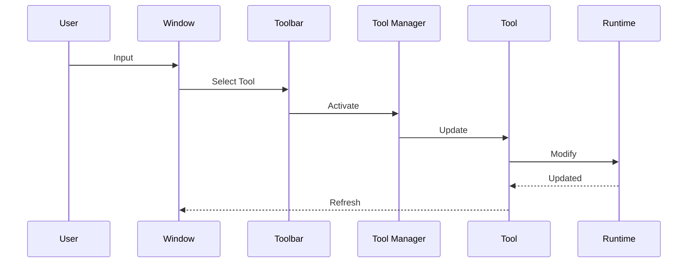

# API Reference

이 문서는 WorldBuilder에서 제공하는 주요 API와 아키텍처를 설명합니다.

> 참고
>
> 이 문서는 Public API를 대상으로 합니다.
> 내부 구현(Internal)은 언제든 변경될 수 있습니다.

---

# API Architecture

WorldBuilder는 다음과 같은 계층으로 구성됩니다.

```
Editor Window

↓

Toolbar

↓

Tool Manager

↓

Current Tool

↓

Runtime Data

↓

Export Pipeline
```

Editor Window는
사용자 입력을 Tool Manager에 전달합니다.

Tool Manager는
현재 활성화된 Tool을 실행합니다.

Tool은 Runtime Data를 수정합니다.

---

# Core Components

대표적인 컴포넌트는 다음과 같습니다.

|Component|Role|
|---------|----|
|WorldBuilder Window|메인 Editor Window|
|Toolbar|Tool 선택|
|Tool Manager|현재 Tool 관리|
|Tool|편집 기능|
|Runtime Data|데이터 저장|
|Export Pipeline|데이터 Export|

---

# Tool API

모든 Tool은 동일한 역할을 수행합니다.

## Responsibilities

Tool은 다음 기능만 담당해야 합니다.

- Scene 입력
- Scene GUI
- Runtime Data 수정
- Preview

다음 기능은 Tool이 담당하지 않습니다.

- Export
- Save
- Project Settings
- Package Settings

---

# Tool Lifecycle

모든 Tool은 다음 순서대로 동작합니다.

```
Initialize()

↓

Activate()

↓

Update()

↓

OnSceneGUI()

↓

Deactivate()

↓

Dispose()
```

각 단계는 서로 다른 책임을 가집니다.

---

## Initialize()

Tool이 생성될 때 호출됩니다.

주요 작업

- 캐시 생성
- 참조 저장
- 이벤트 등록

---

## Activate()

Tool 선택 시 호출됩니다.

주요 작업

- 상태 초기화
- Preview 생성
- Selection 갱신

---

## Update()

Tool이 활성화되어 있는 동안 호출됩니다.

예시

- 입력 검사
- Preview 계산
- 상태 업데이트

---

## OnSceneGUI()

Scene View 렌더링.

예시

- Handles
- Gizmos
- Brush
- Preview

---

## Deactivate()

다른 Tool이 선택될 때 호출됩니다.

주요 작업

- Preview 제거
- 이벤트 해제

---

## Dispose()

Tool 제거 시 호출됩니다.

주요 작업

- Resource 해제
- Cache 제거

---

# Runtime API

Runtime은 다음 데이터를 제공합니다.

- Serializable Data
- ScriptableObject
- Shared Types
- Runtime Models

Editor는 Runtime을 수정하지만
Runtime은 Editor에 의존하지 않습니다.

---

# Export API

Export Pipeline은 다음 순서를 따릅니다.

```
Collect

↓

Validate

↓

Convert

↓

Serialize

↓

Output
```

각 단계는 독립적으로 구현되어야 합니다.

---

# Validation API

Validation은 Export 이전에 수행됩니다.

대표적인 검사

- Missing Asset
- Invalid Data
- Duplicate
- Null Reference

Validation 실패 시 Export를 중단합니다.

---

# Event Flow



---

# Best Practices

## Runtime 수정

Tool은 Runtime Data만 수정합니다.

Scene Object를 직접 수정하는 구조는 권장하지 않습니다.

---

## Stateless Tool

가능한 한 Tool 내부 상태를 최소화합니다.

Runtime을 Single Source of Truth로 유지하는 것이 좋습니다.

---

## Editor 분리

Runtime Assembly에는

- Handles
- SceneView
- EditorGUILayout

등 Editor API를 포함하지 않습니다.

---

# Thread Safety

현재 Tool API는 Unity Main Thread에서 동작하는 것을 전제로 합니다.

별도의 Worker Thread에서 Runtime Data를 수정하는 것은 권장하지 않습니다.

---

# Error Handling

모든 API는 가능한 한 명확한 오류를 반환해야 합니다.

예시

✔ Missing Runtime Data

✔ Invalid Selection

✔ Missing Asset

✔ Invalid Export Path

---

# Extension Points

WorldBuilder는 다음 영역을 확장할 수 있습니다.

- New Tool
- New Exporter
- New Validator
- New Runtime Model
- New Editor Window

---

# API Stability

Public API는 하위 호환성을 유지하는 것을 목표로 합니다.

Internal API는 예고 없이 변경될 수 있습니다.

---

# Summary

WorldBuilder API는

- Tool 중심 구조
- Runtime 중심 데이터 관리
- 독립적인 Export Pipeline

을 기반으로 설계되었습니다.

새로운 기능은 Public API를 통해 확장하는 것을 권장합니다.