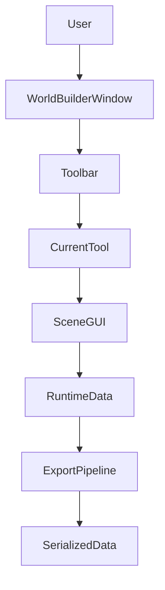

# Architecture

이 문서는 WorldBuilder의 전체 아키텍처와 주요 시스템의 역할을 설명합니다.

WorldBuilder는 Unity Editor에서 월드 데이터를 생성하고 관리하기 위한 **도구 중심(Editor Tool-Based) 아키텍처**를 사용합니다.

Editor 기능과 Runtime 기능을 명확하게 분리하여 유지보수성과 확장성을 높이는 것을 목표로 합니다.

---

# 전체 구조

```
WorldBuilder

├── Editor
│   ├── Editor Window
│   ├── Toolbar
│   ├── Built-in Tools
│   ├── Scene Interaction
│   └── Export
│
├── Runtime
│   ├── Runtime Data
│   ├── Serializable Models
│   ├── ScriptableObjects
│   └── Shared Types
│
└── Documentation
```

Editor는 월드를 제작하는 역할을 담당하며,

Runtime은 제작된 데이터를 저장하고
런타임에서 사용할 수 있는 형태로 제공합니다.

---

# Editor Layer

Editor Layer는 사용자가 직접 상호작용하는 영역입니다.

주요 구성 요소는 다음과 같습니다.

- WorldBuilder Window
- Toolbar
- Tool Framework
- Scene GUI
- Inspector
- Export

Editor Layer는 Unity Editor에서만 동작합니다.

---

# Runtime Layer

Runtime Layer는 Tool과 독립적으로 존재합니다.

주요 역할은

- 데이터 저장
- ScriptableObject
- Serializable 구조체
- 공통 모델 제공

입니다.

Runtime 코드는
Editor 없이도 사용할 수 있도록 설계됩니다.

---

# Tool Architecture

WorldBuilder의 핵심은 Tool 시스템입니다.

모든 기능은 Tool 단위로 구현됩니다.

```
WorldBuilder

↓

Current Tool

↓

Scene GUI

↓

Runtime Data
```

각 Tool은 하나의 작업만 수행합니다.

예를 들어

- Mesh Editing
- Terrain Painting
- Prefab Placement

등은 각각 독립적인 Tool입니다.

---

# Tool Lifecycle

Tool은 다음과 같은 생명주기를 가집니다.

```
Register

↓

Initialize

↓

Activate

↓

Update

↓

Handle Input

↓

Deactivate

↓

Dispose
```

각 단계는 Tool이 필요한 리소스를 생성하거나 해제하는 역할을 담당합니다.

---

# Data Flow

일반적인 데이터 흐름은 다음과 같습니다.

```
User Input

↓

Editor Window

↓

Current Tool

↓

Runtime Data

↓

Export Pipeline

↓

Serialized Data
```

Tool은 Scene을 직접 수정하기보다
Runtime 데이터를 변경하는 것을 우선으로 합니다.

---

# Scene Interaction

Scene View는 Tool의 작업 공간입니다.

Tool은 Scene View에서

- Mouse Input
- Handles
- Selection
- Brush
- Gizmo

등을 사용하여 데이터를 수정합니다.

---

# Export Pipeline

편집된 데이터는 Export Pipeline을 통해
런타임에서 사용할 수 있는 형태로 변환됩니다.

```
Runtime Data

↓

Validation

↓

Conversion

↓

Serialization

↓

Output
```

Export 과정에서는 데이터 검증이 수행될 수 있습니다.

---

# Folder Responsibilities

| Folder | Responsibility |
|---------|----------------|
| Editor | 모든 Editor 기능 |
| Runtime | 런타임 데이터 및 공용 코드 |
| Documentation | 패키지 문서 |
| package.json | 패키지 메타데이터 |

---

# Design Principles

WorldBuilder는 다음 원칙을 따릅니다.

## Single Responsibility

각 Tool은 하나의 기능만 담당합니다.

---

## Extensibility

새로운 Tool을 추가하기 위해 기존 Tool을 수정하지 않아야 합니다.

---

## Editor / Runtime Separation

Editor와 Runtime은 서로 독립적으로 유지됩니다.

---

## Data-Oriented Workflow

Scene보다 데이터를 중심으로 작업합니다.

---

## Modular Design

모든 Tool은 독립적으로 개발 및 유지보수가 가능하도록 설계됩니다.

---

# Architecture Overview



---

# Next Step

아키텍처를 이해했다면

다음 문서인 **ToolSystem.md**를 읽는 것을 권장합니다.

ToolSystem에서는

- Tool 등록
- Tool 생명주기
- Tool 인터페이스
- Scene GUI 연결
- 확장 방법

등을 자세히 설명합니다.