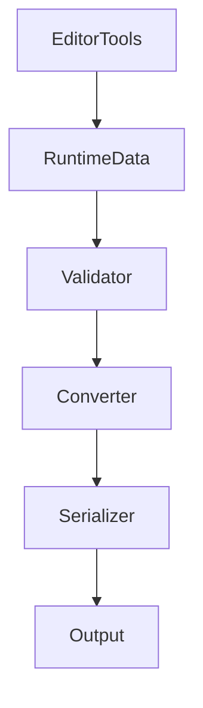

# Export Pipeline

WorldBuilder의 Export Pipeline은 Editor에서 생성한 월드 데이터를
게임에서 사용할 수 있는 Runtime 데이터로 변환하는 과정입니다.

Export는 단순히 파일을 저장하는 기능이 아니라,
월드 데이터를 검증(Validation), 변환(Conversion), 직렬화(Serialization)하여
런타임에서 사용할 수 있는 형태로 생성하는 역할을 수행합니다.

---

# Pipeline Overview

전체 Export 과정은 다음과 같습니다.

```text
Editor Tools

↓

Runtime Data

↓

Validation

↓

Data Conversion

↓

Serialization

↓

Output
```

각 단계는 독립적으로 동작하며,
문제가 발생할 경우 Export를 중단하고 오류를 보고할 수 있습니다.

---

# Export Stages

## 1. Runtime Data Collection

Editor Tool이 수정한 모든 Runtime Data를 수집합니다.

예를 들어

- Terrain
- Spawn
- Biome
- Environment
- Prefab Placement

등이 포함될 수 있습니다.

이 단계에서는 데이터를 변경하지 않습니다.

---

## 2. Validation

데이터가 정상적인 상태인지 검사합니다.

대표적인 검사항목

✔ Null Reference

✔ Duplicate Entry

✔ Missing Asset

✔ Invalid Range

✔ Invalid Coordinate

✔ Invalid Rotation

✔ Empty Collection

Validation 실패 시

Export는 중단되며
오류 메시지가 표시됩니다.

---

## 3. Data Conversion

Runtime Data를 Export 가능한 형태로 변환합니다.

예시

```text
Scene Object

↓

Runtime Model

↓

Serializable Model
```

이 과정에서는

- Editor 전용 데이터 제거

- 캐시 제거

- 참조 변환

등을 수행합니다.

---

## 4. Serialization

변환된 데이터를 저장 가능한 형식으로 직렬화합니다.

지원 가능한 예

- Binary

- JSON

- ScriptableObject

- Custom Asset

Serialization 과정은
플랫폼 요구사항에 따라 달라질 수 있습니다.

---

## 5. Output

최종 데이터를 프로젝트에 저장합니다.

예시

```text
Assets/

StreamingAssets/

Resources/

Addressables/

Custom Directory
```

프로젝트 설정에 따라 출력 위치는 달라질 수 있습니다.

---

# Data Flow



---

# Validation Rules

Export 전에는 다음 사항을 확인하는 것이 좋습니다.

## Terrain

- Height 범위

- Chunk 연결

- Invalid Vertex

---

## Spawn

- Spawn Position

- Spawn Type

- Duplicate Spawn

---

## Environment

- Zone 범위

- Overlap

- Invalid Value

---

## Prefab

- Missing Prefab

- Invalid Transform

- Missing Component

---

# Error Handling

Validation에서 오류가 발생하면

Export는 즉시 종료되어야 합니다.

오류는 가능한 한

- 무엇이 잘못되었는지

- 어디에서 발생했는지

- 어떻게 수정해야 하는지

를 포함해야 합니다.

예시

```text
[Spawn]

Missing Prefab

Object : FishSpawner_01

Path :

World/Spawn/FishSpawner_01
```

---

# Performance

대규모 월드 Export에서는 다음을 권장합니다.

✔ Incremental Export

✔ Batch Processing

✔ Parallel Serialization

✔ Cached Validation

✔ Allocation 최소화

✔ Progress Bar 제공

---

# Best Practices

## Editor Object를 Export하지 않습니다.

Export 대상은 Runtime Data입니다.

---

## Validation을 생략하지 않습니다.

잘못된 데이터를 Export하면
런타임 오류의 원인이 됩니다.

---

## Export는 결정적(Deterministic)이어야 합니다.

동일한 입력 데이터는
항상 동일한 결과를 생성해야 합니다.

---

## Runtime Format은 Editor와 분리합니다.

Editor 데이터와
게임에서 사용하는 데이터는
가능한 한 분리하는 것이 좋습니다.

---

# Future Improvements

프로젝트 규모가 커질 경우
다음 기능을 고려할 수 있습니다.

- Incremental Export

- Dependency Graph

- Parallel Export

- Export Cache

- Asset Diff

- Validation Report

- Build Pipeline Integration

---

# Summary

Export Pipeline은

- Runtime Data 수집

- Validation

- Data Conversion

- Serialization

- Output

의 다섯 단계로 구성됩니다.

안정적인 Export를 위해서는
Validation과 Runtime Data 관리가 핵심입니다.

---

# Next

다음 문서인 **ExtendingWorldBuilder.md**에서는

- 새로운 Tool 추가

- Tool 등록

- Runtime 연동

- 커스텀 워크플로우 구현

등
WorldBuilder를 확장하는 방법을 설명합니다.