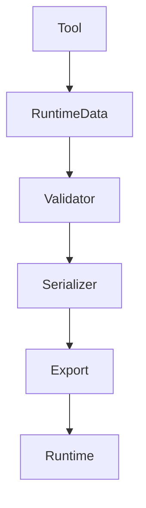

# Runtime

이 문서는 WorldBuilder Runtime의 역할과 데이터 구조를 설명합니다.

Runtime은 Editor에서 생성한 데이터를 저장하고,
런타임에서 사용할 수 있는 형태로 관리하는 계층입니다.

Editor 기능과 완전히 분리되어 있으며,
게임 실행 중에도 사용할 수 있는 공용 데이터 구조를 제공합니다.

---

# Runtime Architecture

Runtime Layer는 다음과 같은 역할을 담당합니다.

- World Data 저장
- Serializable Model 제공
- ScriptableObject 정의
- 공통 타입 제공
- Export 대상 데이터 관리

```
Editor

↓

Runtime Data

↓

Serializer

↓

Binary / Asset
```

Runtime은 Scene을 직접 수정하지 않습니다.

모든 변경은 Editor Tool을 통해 이루어집니다.

---

# Runtime Components

Runtime은 크게 다음과 같은 구성 요소로 이루어집니다.

```
Runtime

├── Data
├── Models
├── ScriptableObjects
├── Serialization
└── Shared Types
```

---

# Runtime Data

Runtime Data는 WorldBuilder의 핵심 데이터입니다.

모든 Tool은 Runtime Data를 수정하며,
Export 과정에서는 Runtime Data를 기반으로 데이터를 생성합니다.

예시

```
Terrain Data

↓

Modify

↓

Runtime Data Updated
```

Runtime Data는 가능한 한
Unity Editor API에 의존하지 않아야 합니다.

---

# Serializable Models

Runtime은 직렬화 가능한 모델을 제공합니다.

직렬화 모델은

- 저장
- Export
- Network
- Runtime Loading

등에서 사용할 수 있습니다.

권장 사항

✔ 순수 데이터만 포함

✔ Unity Editor API 사용 금지

✔ 계산 로직 최소화

---

# ScriptableObject

설정 데이터는 ScriptableObject를 통해 관리됩니다.

예를 들어

- Tool Settings

- Biome Data

- Spawn Data

- Environment Data

등이 이에 해당합니다.

ScriptableObject는

- 프로젝트 전체에서 공유 가능

- Inspector에서 수정 가능

- Version Control에 적합

합니다.

---

# Shared Types

Runtime은 Editor와 Runtime이
공통으로 사용하는 타입을 제공합니다.

예를 들어

- Enums

- Serializable Struct

- Interfaces

- Constants

등이 있습니다.

---

# Data Ownership

Runtime은 실제 데이터를 소유합니다.

```
Tool

↓

Modify

↓

Runtime Data

↓

Save
```

Tool은 Runtime Data를 수정할 뿐,
데이터를 직접 보관하지 않습니다.

---

# Data Lifecycle

일반적인 데이터 생명주기는 다음과 같습니다.

```
Create

↓

Edit

↓

Validate

↓

Serialize

↓

Export

↓

Load

↓

Use
```

---

# Validation

Export 이전에는 데이터 검증이 수행될 수 있습니다.

대표적인 검증 항목

- Null Reference

- Invalid Settings

- Duplicate Data

- Missing Assets

- Invalid Range

검증 실패 시 Export가 중단될 수 있습니다.

---

# Serialization

Runtime Data는
직렬화 과정을 거쳐 저장됩니다.

지원 가능한 예시

- Binary

- JSON

- ScriptableObject

- Custom Format

직렬화 방식은 프로젝트 요구사항에 따라 달라질 수 있습니다.

---

# Memory Management

Runtime Data는
가능한 한 메모리 사용량을 최소화하도록 설계되어야 합니다.

권장 사항

- 데이터 캐싱

- Struct 적극 활용

- Allocation 최소화

- 불필요한 List 생성 방지

- LINQ 최소화

---

# Best Practices

## Runtime에는 Editor API를 사용하지 않습니다.

좋은 예

- 순수 데이터

- Serializable Model

- Struct

나쁜 예

- Handles

- SceneView

- GUILayout

- EditorGUILayout

---

## Tool은 Runtime을 수정합니다.

Tool은

- 데이터 생성

- 데이터 수정

- 데이터 삭제

만 수행해야 합니다.

실제 저장은 Runtime에서 담당합니다.

---

## Runtime은 독립적이어야 합니다.

Runtime Assembly는
Unity Editor 없이도 컴파일 가능해야 합니다.

---

# Architecture



---

# Summary

Runtime Layer는

- 데이터 저장

- 직렬화

- ScriptableObject

- 공통 타입

- Export 대상 관리

를 담당합니다.

Editor는 Runtime을 수정하지만,

Runtime은 Editor에 의존하지 않습니다.

---

# Next

다음 문서에서는

**ExportPipeline.md**

를 통해

- Export 과정

- Validation

- Serializer

- Output

구조를 자세히 설명합니다.