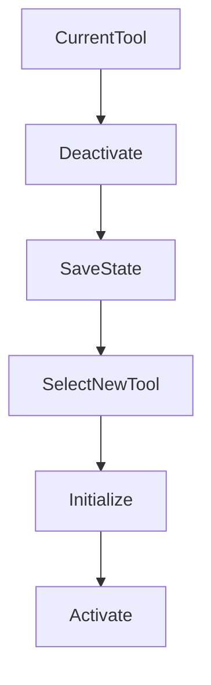

# Tool System

WorldBuilder의 모든 편집 기능은 **Tool System**을 기반으로 동작합니다.

Tool System은 각각의 편집 기능을 독립적인 모듈로 관리하여
유지보수성과 확장성을 높이기 위해 설계되었습니다.

각 Tool은 하나의 책임만 가지며,
WorldBuilder Window를 통해 활성화됩니다.

---

# Tool Overview

모든 Tool은 동일한 실행 흐름을 따릅니다.

```
Toolbar

↓

Select Tool

↓

Activate

↓

Handle Scene

↓

Modify Runtime Data

↓

Deactivate
```

사용자는 Toolbar에서 Tool을 선택하면
해당 Tool이 활성화됩니다.

동시에 여러 Tool이 활성화되지 않습니다.

---

# Tool Responsibilities

Tool은 다음 역할만 수행해야 합니다.

- Scene 입력 처리
- Handles 렌더링
- 선택 처리
- Runtime Data 수정
- Gizmo 표시

반대로 다음 기능은 Tool이 담당하지 않습니다.

- Window 관리
- Toolbar 관리
- Export
- 프로젝트 설정
- Runtime 초기화

---

# Tool Lifecycle

모든 Tool은 일정한 생명주기를 가집니다.

```
Create

↓

Initialize

↓

Activate

↓

Update

↓

Handle Input

↓

Draw Scene GUI

↓

Deactivate

↓

Dispose
```

---

## Initialize

Tool이 처음 생성될 때 호출됩니다.

이 단계에서는

- 캐시 생성
- 참조 저장
- 이벤트 등록

등을 수행합니다.

가능한 한 무거운 작업은 피하는 것이 좋습니다.

---

## Activate

사용자가 Tool을 선택하면 호출됩니다.

이 단계에서는

- 상태 초기화
- 선택 정보 갱신
- UI 초기화

등을 수행합니다.

---

## Update

Tool이 활성화되어 있는 동안
매 프레임 호출됩니다.

일반적으로

- 상태 갱신
- 입력 검사
- Preview 계산

등을 수행합니다.

---

## Scene GUI

Scene View에서 호출됩니다.

여기서는

- Handles
- Gizmo
- Selection
- Brush

등을 그립니다.

Scene GUI에서는
가능한 한 그리기 작업만 수행하는 것이 좋습니다.

---

## Handle Input

마우스 입력과 키보드 입력을 처리합니다.

예를 들어

- Click
- Drag
- Shift
- Ctrl
- Alt

등을 검사합니다.

---

## Deactivate

다른 Tool이 선택되면 호출됩니다.

이 단계에서는

- Preview 제거
- 이벤트 해제
- 임시 데이터 삭제

등을 수행합니다.

---

## Dispose

Tool이 제거될 때 호출됩니다.

Dispose에서는

- Native Resource 해제
- 캐시 제거
- 이벤트 해제

등을 수행합니다.

---

# Tool Switching

Tool 전환 과정은 다음과 같습니다.



이 과정은 Tool 간의 충돌을 방지합니다.

---

# Runtime Communication

Tool은 Runtime Layer와 직접 연결됩니다.

```
Scene Input

↓

Current Tool

↓

Runtime Data

↓

World Data
```

Tool은 Runtime 데이터를 수정하지만
Export는 수행하지 않습니다.

---

# Scene Interaction

Tool은 Scene View에서 다음 요소를 사용할 수 있습니다.

- Handles

- Gizmos

- Selection

- Mouse Picking

- Brush Preview

- Grid

가능하면 Unity의 기본 Handle API를 사용하는 것을 권장합니다.

---

# Tool Registration

새로운 Tool은 Tool Registry에 등록되어야 합니다.

등록이 완료되면

- Toolbar

- Shortcut

- Window

에서 사용할 수 있습니다.

등록 과정은 프로젝트의 Tool 관리 시스템에 의해 자동으로 수행될 수도 있습니다.

---

# Best Practices

## 하나의 Tool은 하나의 기능만 수행합니다.

좋은 예

```
Mesh Editor

Terrain Painter

Spawn Editor
```

나쁜 예

```
World Editor

↓

Mesh

Terrain

Spawn

Lighting

Prefab

Export
```

---

## Tool끼리 직접 통신하지 않습니다.

Tool A가

Tool B를 호출하는 구조는 권장하지 않습니다.

공통 Runtime Data를 통해
간접적으로 통신하는 것이 좋습니다.

---

## 상태는 Runtime에 저장합니다.

Tool 내부에는

- 현재 선택

- Preview

- Cache

등 임시 상태만 저장합니다.

실제 데이터는 Runtime Layer에서 관리합니다.

---

# Performance

Tool 구현 시 권장 사항

✔ 캐시 적극 활용

✔ Scene GUI에서 Allocation 최소화

✔ GC 발생 최소화

✔ Update에서 LINQ 사용 지양

✔ 반복 계산 캐싱

✔ Undo 시스템 활용

---

# Extending the Tool System

새로운 Tool을 추가하려면

1.

새 Tool 클래스를 생성합니다.

↓

2.

Tool Base를 상속합니다.

↓

3.

필요한 인터페이스를 구현합니다.

↓

4.

Toolbar에 등록합니다.

↓

5.

Scene GUI를 구현합니다.

↓

6.

Runtime Data와 연결합니다.

---

# Summary

WorldBuilder의 Tool System은

- 독립성

- 확장성

- 유지보수성

을 목표로 설계되었습니다.

새로운 Tool은 기존 Tool을 수정하지 않고도
쉽게 추가할 수 있으며,
각 Tool은 자신의 책임만 수행해야 합니다.

---

# Next

다음 문서는

**BuiltInTools.md**

입니다.

여기서는 프로젝트에 포함된

- Mesh Editor
- Terrain Painter
- Prefab Brush
- Spawn Editor
- Air Pocket Tool
- Bin Importer
- Bioluminescence Tool

을 하나씩 설명합니다.